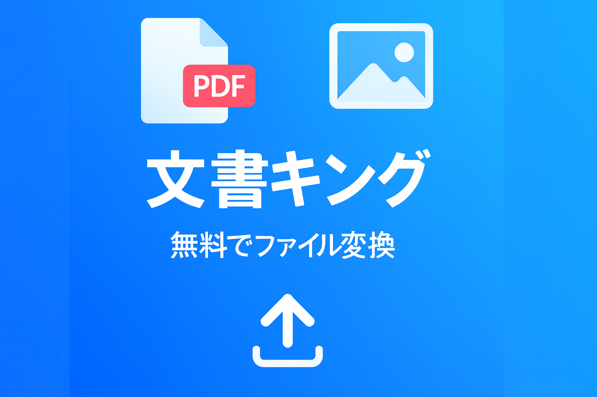

# ドキュメントキング (DocumentKing) - 無料ファイル変換ツール

## 📋 プロジェクト概要

ドキュメントキングは、PDF、Word、Excel、PowerPoint、画像ファイルを簡単で高速に無料で変換できるオンラインツールです。インストールや会員登録なしで誰でもすぐに使用でき、国内サーバーを運営して高速な処理を提供します。

## ✨ 主要機能

### 📄 文書変換
- **PDF → Word/Excel/PowerPoint/画像**
- **Word/Excel/PowerPoint → PDF**
- **PDF編集**: 結合、分割、ページ抽出/削除、圧縮

### 🖼️ 画像変換
- **画像 → PDF**: JPG、PNG、WEBP、HEIC対応
- **画像フォーマット変換**: JPG ↔ PNG ↔ WEBP ↔ HEIC
- **画像最適化**: 容量削減、サイズ調整

### 🔧 高度な機能
- **ドラッグ&ドロップ**ファイルアップロード
- **自動変換ツール推奨**
- **リアルタイム進捗**表示
- **モバイル最適化**レスポンシブデザイン
- **PWA対応** (Progressive Web App)

## 🛠️ 技術スタック

### Frontend
- **Next.js 15** - Reactフレームワーク
- **React 19** - UIライブラリ
- **Tailwind CSS 4** - スタイリング
- **TypeScript** - 型安全性

### UI/UX
- **Radix UI** - アクセシビリティコンポーネント
- **Lucide React** - アイコン
- **React Icons** - 追加アイコン

### パフォーマンス & SEO
- **Vercel Analytics** - ユーザー分析
- **Next.js Image Optimization** - 画像最適化
- **Structured Data** - 検索エンジン最適化
- **PWA** - モバイルアプリ体験

### デプロイ & インフラ
- **Vercel** - ホスティングプラットフォーム
- **Google AdSense** - 広告収益化
- **Naver Analytics** - 韓国ユーザー分析

## 📊 パフォーマンス最適化

- **画像最適化**: WebP、AVIFフォーマット対応
- **コード分割**: 動的インポートによるバンドルサイズ最適化
- **キャッシュ戦略**: Service Workerによるオフライン対応
- **SEO最適化**: メタデータ、構造化データ適用

## 🔒 セキュリティとプライバシー

- **ファイル自動削除**: 変換後1時間以内に自動削除
- **HTTPS送信**: すべてのデータ暗号化送信
- **プライバシー最小化**: 不要な情報収集なし

## 📱 PWA機能

- **オフライン対応**: キャッシュされたページアクセス可能
- **ホーム画面追加**: モバイルでアプリのように使用
- **プッシュ通知**: 更新通知（オプション）

## 📞 お問い合わせ

- **メール**: contact@pdfers.com
- **ウェブサイト**: https://www.pdfers.com
- **お問い合わせページ**: https://www.pdfers.com/contact

## 🙏 謝辞

- [Next.js](https://nextjs.org/) - 素晴らしいReactフレームワーク
- [Tailwind CSS](https://tailwindcss.com/) - ユーティリティファーストCSSフレームワーク
- [Vercel](https://vercel.com/) - 高速で安定したホスティングプラットフォーム
- [Radix UI](https://www.radix-ui.com/) - アクセシビリティ重視のUIコンポーネント

---

**ドキュメントキング**でより良い文書作業体験を作りましょう！📚✨
